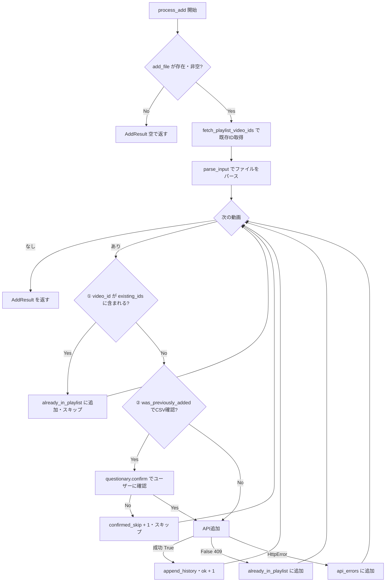

# 設計: プレイリスト事前チェック機能

## 変更対象コンポーネント

```
repository/youtube.py         ← fetch_playlist_video_ids() を追加
service/sync.py               ← process_add() のロジック変更（シグネチャは維持）
tests/test_fetch_playlists.py ← fetch_playlist_video_ids のテスト追加
tests/test_process.py         ← TestProcessAdd を更新
```

---

## 新関数: `fetch_playlist_video_ids`

### 配置

`repository/youtube.py`

### シグネチャ

```python
def fetch_playlist_video_ids(youtube, playlist_id: str) -> set[str]:
```

### 実装

```python
def fetch_playlist_video_ids(youtube, playlist_id: str) -> set[str]:
    ids: set[str] = set()
    next_token = None
    while True:
        kwargs = dict(part="snippet", playlistId=playlist_id, maxResults=50)
        if next_token:
            kwargs["pageToken"] = next_token
        res = youtube.playlistItems().list(**kwargs).execute()
        for item in res.get("items", []):
            ids.add(item["snippet"]["resourceId"]["videoId"])
        next_token = res.get("nextPageToken")
        if not next_token:
            break
    return ids
```

---

## 変更: `process_add` のロジック

### シグネチャ（変更なし）

```python
def process_add(youtube, playlist: dict, history: list[dict], add_file: Path, csv_path: Path) -> AddResult:
```

### 変更後のフロー



### `AddResult.already_in_playlist` の意味

自動スキップされた動画（プレイリスト既存 or 409フォールバック）のリスト。ユーザー確認は不要と判断したケース。

---

## 変更なし

| ファイル | 理由 |
|---|---|
| `domain/models.py` | `AddResult` のフィールド定義は変わらない |
| `repository/history.py` | `was_previously_added` は引き続き使用 |
| `controller/cli.py` | `process_add` のシグネチャが変わらないため修正不要 |
| `tests/test_csv_history.py` | 影響なし |
