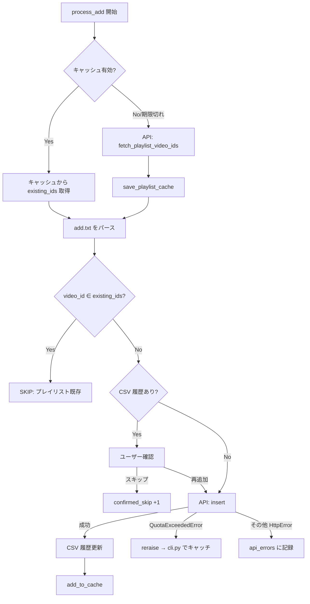

# design.md

## 実装アプローチ

3つの問題をそれぞれ独立したレイヤーで解決する。

| 問題 | 解決策 | 変更レイヤー |
|---|---|---|
| クラッシュ | `fetch_playlists`・`fetch_playlist_video_ids` に `api_call_with_retry` を適用 | `repository/youtube.py` |
| 無意味なリトライ | リトライ廃止 → `QuotaExceededError` を raise して即終了 | `repository/youtube.py` / `controller/cli.py` |
| 毎回全件取得 | プレイリスト動画IDをローカルキャッシュ（TTL: 23h） | `repository/cache.py`（新規）/ `service/sync.py` |

---

## 変更コンポーネント

```mermaid
graph TD
    A[controller/cli.py] -->|QuotaExceededError をキャッチ| B[service/sync.py]
    B -->|キャッシュ読み書き| C[repository/cache.py NEW]
    B -->|API呼び出し| D[repository/youtube.py]
    D -->|QuotaExceededError を raise| A
    E[docker-compose.yml] -->|ボリューム設定変更| F[/data/youtube/ ディレクトリ全体]
```

---

## 詳細設計

### 1. `repository/youtube.py` の変更

#### 1-1. `QuotaExceededError` の追加

```python
class QuotaExceededError(Exception):
    """YouTube API の日次クォータ超過時に raise する。"""
    pass
```

#### 1-2. `api_call_with_retry` の変更

無限ループを廃止。クォータ超過時は `QuotaExceededError` を raise する。

```python
# Before
def api_call_with_retry(fn):
    while True:
        try:
            return fn()
        except HttpError as e:
            if e.resp.status == 403 and b"quotaExceeded" in e.content:
                print(f"[WARN] Quota超過。{QUOTA_WAIT}秒後に再試行...")
                time.sleep(QUOTA_WAIT)
            else:
                raise

# After
def api_call_with_retry(fn):
    try:
        return fn()
    except HttpError as e:
        if e.resp.status == 403 and b"quotaExceeded" in e.content:
            raise QuotaExceededError()
        raise
```

#### 1-3. `fetch_playlists` の変更

`api_call_with_retry` でラップする。起動直後に呼ばれるため、ここでクォータ超過が発生してもクラッシュしないようにする。

```python
# Before
res = youtube.playlists().list(part="snippet", mine=True, maxResults=50).execute()

# After
res = api_call_with_retry(lambda: youtube.playlists().list(part="snippet", mine=True, maxResults=50).execute())
```

#### 1-4. `fetch_playlist_video_ids` の変更

`api_call_with_retry` でラップする。

```python
# Before
res = youtube.playlistItems().list(**kwargs).execute()

# After
res = api_call_with_retry(lambda: youtube.playlistItems().list(**kwargs).execute())
```

#### 1-4. `quota_reset_message()` の追加

太平洋時間の次の午前0時までの残り時間を計算して返す。

```python
def quota_reset_message() -> str:
    from zoneinfo import ZoneInfo
    pacific = ZoneInfo("America/Los_Angeles")
    now_pt = datetime.now(pacific)
    next_reset = (now_pt + timedelta(days=1)).replace(
        hour=0, minute=0, second=0, microsecond=0
    )
    delta = next_reset - now_pt
    hours, rem = divmod(int(delta.total_seconds()), 3600)
    minutes = rem // 60
    return (
        f"[ERROR] YouTube API の1日のクォータ上限（10,000ユニット）に達しました。\n"
        f"クォータは太平洋時間の午前0時にリセットされます。\n"
        f"約 {hours}時間{minutes}分後（PT {next_reset.strftime('%H:%M')}）に再実行してください。"
    )
```

---

### 2. `repository/cache.py`（新規）

プレイリストIDごとに動画IDセットをJSONでキャッシュする。

#### キャッシュファイル形式

```json
{
  "fetched_at": "2026-06-26T12:00:00+00:00",
  "video_ids": ["abc123", "def456", "..."]
}
```

#### キャッシュファイルパス

```
/data/youtube/playlist_cache_{playlist_id}.json
```

#### 公開インターフェース

| 関数 | 説明 |
|---|---|
| `load_playlist_cache(playlist_id, cache_dir)` | 有効なキャッシュがあれば `set[str]` を返す。なければ `None` |
| `save_playlist_cache(playlist_id, video_ids, cache_dir)` | 全件をキャッシュとして保存（`fetched_at` を現在時刻で記録） |
| `add_to_cache(playlist_id, video_id, cache_dir)` | 追加成功後にキャッシュへ1件追加 |
| `remove_from_cache(playlist_id, video_id, cache_dir)` | 削除成功後にキャッシュから1件除去 |

#### TTL判定

- デフォルト: 23 時間（環境変数 `CACHE_TTL_HOURS` で上書き可）
- `datetime.now(UTC) - fetched_at > TTL` の場合はキャッシュ無効（`None` を返す）

---

### 3. `service/sync.py` の変更

#### `process_add` のフロー変更



#### `process_remove` のフロー変更

削除成功後に `remove_from_cache` を呼ぶ。

---

### 4. `controller/cli.py` の変更

`CACHE_DIR` 定数を追加し、`process_add` / `process_remove` に渡す。

```python
CACHE_DIR = Path("/data/youtube")
```

`QuotaExceededError` は **2箇所**でキャッチする：

```python
# ① 起動時のプレイリスト取得（choose_playlists → fetch_playlists）
try:
    add_pl, remove_pl = choose_playlists(youtube, config_path)
except QuotaExceededError:
    print(quota_reset_message())
    sys.exit(1)

# ② 追加・削除処理（process_add / process_remove）
try:
    add_result = process_add(...)
    remove_result = process_remove(...)
except QuotaExceededError:
    print(quota_reset_message())
    sys.exit(1)
```

> **実装中に発覚した問題（2026-06-26）:**
> 当初の設計では `process_add/remove` のみを `try` で囲んでいたが、
> `choose_playlists` 内の `fetch_playlists` でもクォータ超過が発生し得るため、
> `choose_playlists` の呼び出しも別途 `try/except` でラップする必要があった。

---

### 5. `docker-compose.yml` の変更

現在はCSVファイル単体をバインドマウントしているが、キャッシュファイルも永続化が必要なため
**ディレクトリ全体**のマウントに変更する。

```yaml
# Before
volumes:
  - type: bind
    source: ../../footprints/youtube/playlist_history.csv
    target: /data/youtube/playlist_history.csv

# After
volumes:
  - type: bind
    source: ../../footprints/youtube
    target: /data/youtube
```

> `footprints/youtube/` ディレクトリはホスト側に既に存在しているため、
> `playlist_history.csv` の既存データに影響はない。

---

## 変更ファイル一覧

| ファイル | 変更種別 | 内容 |
|---|---|---|
| `src/repository/youtube.py` | 変更 | `QuotaExceededError` 追加・`api_call_with_retry` 修正・`fetch_playlists` 修正・`fetch_playlist_video_ids` 修正・`quota_reset_message` 追加 |
| `src/repository/cache.py` | 新規 | プレイリストIDキャッシュの読み書き |
| `src/service/sync.py` | 変更 | キャッシュ利用・インクリメンタル更新・`cache_dir` 引数追加 |
| `src/controller/cli.py` | 変更 | `QuotaExceededError` キャッチ・`CACHE_DIR` 定数追加 |
| `docker-compose.yml` | 変更 | ボリュームマウントをファイル単体 → ディレクトリに変更 |

---

## 影響しないファイル

- `domain/models.py` / `domain/parser.py` — 変更なし
- `repository/history.py` / `repository/config.py` — 変更なし
- `footprints/youtube/playlist_history.csv` — データはそのまま維持
