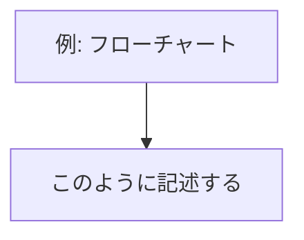

# CLAUDE.md (プロジェクトメモリ)

## 概要
開発を進めるうえで遵守すべき標準ルールを定義します。

---

## プロジェクト構造

### ドキュメントの分類

#### 1. 永続的ドキュメント（`docs/`）

アプリケーション全体の「**何を作るか**」「**どう作るか**」を定義する恒久的なドキュメント。
アプリケーションの基本設計や方針が変わらない限り更新されません。

- **product-requirements.md** - プロダクト要求定義書
  - プロダクトビジョンと目的
  - ターゲットユーザーと課題・ニーズ
  - 主要な機能一覧
  - 成功の定義
  - ユーザーストーリー・受け入れ条件
  - 機能要件・非機能要件

- **functional-design.md** - 機能設計書
  - 機能ごとのアーキテクチャ
  - データモデル定義
  - コンポーネント設計

- **architecture.md** - 技術仕様書
  - テクノロジースタック
  - 開発ツールと手法
  - 技術的制約と要件

- **repository-structure.md** - リポジトリ構造定義書
  - フォルダ・ファイル構成
  - ディレクトリの役割

- **development-guidelines.md** - 開発ガイドライン
  - コーディング規約・命名規則
  - テスト規約
  - Git規約

- **glossary.md** - ユビキタス言語定義


#### 2. 作業単位のドキュメント（`.steering/[YYYYMMDD]-[開発タイトル]/`）

特定の開発作業における「**今回何をするか**」を定義する一時的なステアリングファイル。
作業完了後は参照用として保持されますが、新しい作業では新しいディレクトリを作成します。

- **requirements.md** - 今回の作業の要求内容
  - 変更・追加する機能の説明
  - ユーザーストーリー・受け入れ条件
  - 制約事項

- **design.md** - 変更内容の設計
  - 実装アプローチ
  - 変更するコンポーネント
  - データ構造の変更・影響範囲

- **test-cases.md** - テストケース一覧（**実装前に必ず作成・承認を得る**）
  - 機能単位のテストケース（正常系・準正常系・異常系）
  - 各ケースの入力・期待値・確認方法
  - テスト妥当性の確認基準

- **tasklist.md** - タスクリスト
  - TDDサイクル単位の実装タスク
  - タスクの進捗状況・完了条件

- **blockers.md** - (オプション) ブロッカーの記録
  - 発生日時・問題内容・原因・対処策・ステータス
  - 作業の中断・遅延が生じた際に作成する

- **decisions.md** - (オプション) 重要な決定事項の記録
  - 決定日・背景・選択肢・決定内容・採用理由
  - 後から「なぜこうしたのか」が不明瞭になりそうな判断をした際に作成する


### ステアリングディレクトリの命名規則

```
.steering/[YYYYMMDD]-[開発タイトル]/
```

---

## 開発プロセス

### 初回セットアップ時の手順

#### 1. フォルダ作成
```bash
mkdir -p docs .steering
```

#### 2. 永続的ドキュメント作成（`docs/`）

1ファイルごとに作成後、必ず確認・承認を得てから次のファイルを作成する。

#### 3. 初回実装用ステアリングファイル作成

```bash
mkdir -p .steering/[YYYYMMDD]-initial-implementation
```

1. `requirements.md` - 初回実装の要求
2. `design.md` - 実装設計
3. `test-cases.md` - テストケース一覧（**承認後にテスト実装へ進む**）
4. `tasklist.md` - 実装タスク（TDDサイクル単位）

**重要：** 1ファイルごとに確認・承認を得てから次のファイルを作成する

#### 4. 環境セットアップ

#### 5. TDDサイクルで実装（tasklist.mdに基づく）

タスクごとに以下のRed-Green-Refactorサイクルを回す：

1. **Red**: `test-cases.md` を参照してテストコードを書く → 失敗することを確認
2. **Green**: テストが通る最小限の実装を書く
3. **Refactor**: テストを保ちながらコードを整理
4. **Commit**: `git commit` でタスク完了を記録（テストが通っている状態でのみコミット）

#### 6. 品質チェック


### 機能追加・修正時の手順

#### 1. 影響分析

- 永続的ドキュメント（`docs/`）への影響を確認
- 変更が基本設計に影響する場合は `docs/` を更新

#### 2. ステアリングディレクトリ作成

```bash
mkdir -p .steering/[YYYYMMDD]-[開発タイトル]
```

#### 3. 作業ドキュメント作成

1ファイルごとに確認・承認を得てから次のファイルを作成する：

1. `requirements.md` - 要求内容
2. `design.md` - 設計
3. `test-cases.md` - テストケース一覧（**承認後にテスト実装へ進む**）
4. `tasklist.md` - タスクリスト（TDDサイクル単位）

オプションファイルは必要が生じた時点で作成する：
- 問題・障害が発生した場合 → `blockers.md`
- 重要な設計判断・技術選択が生じた場合 → `decisions.md`

#### 4. 永続的ドキュメント更新（必要な場合のみ）

#### 5. TDDサイクルで実装

タスクごとにRed-Green-Refactor-Commitサイクルを回す。

#### 6. 品質チェック

---

## TDD原則

### Red-Green-Refactor-Commitサイクル

```
test-cases.md でケース定義
        ↓
テストコードを書く（Red: 失敗を確認）
        ↓
最小限の実装を書く（Green: テストを通す）
        ↓
リファクタリング（Refactor: テストが通る状態を保つ）
        ↓
git commit（タスク単位でコミット）
```

### テストケース作成の原則

- 実装前に `test-cases.md` を作成し、承認を得てからテストコードを書く
- 機能単位で**正常系・準正常系・異常系**をすべて定義する
- 各ケースに「入力」「期待する出力/副作用」「確認方法」を明記する
- テスト不可能な設計になっていないかを `test-cases.md` 作成段階で検証する

### テストの分類

| 種別 | 定義 | 例 |
|---|---|---|
| 正常系 | 想定通りの入力で期待通りの結果が得られる | 有効なURLからvideo_idを抽出 |
| 準正常系 | 境界値・エッジケースでも仕様通りに動く | 重複URL・空行・追加済み動画 |
| 異常系 | 不正な入力・外部障害でクラッシュしない | 無効URL・API 409/403/500 |

### 外部依存のモック方針

- YouTube API クライアントは `unittest.mock` でモック化する
- ファイルI/Oは `tmp_path` フィクスチャ（pytest）を使い実ファイルで検証する
- 時刻依存のテストは `freezegun` または `monkeypatch` で固定する

---

## Gitコミット規則

- **タスクリストの各タスク完了後に必ずコミットする**
- テストがすべて通っている状態でのみコミットする（`git commit --no-verify` は使わない）
- コミットメッセージはタスクの内容を端的に表す日本語で書く

```
# 例
feat: extract_video_id の実装とテスト追加
feat: parse_input の実装とテスト追加（重複除去対応）
feat: CSV履歴管理の実装とテスト追加
```

---

## ドキュメント管理の原則

### 永続的ドキュメント（`docs/`）
- アプリケーションの基本設計を記述
- 大きな設計変更時のみ更新
- プロジェクト全体の「北極星」として機能

### 作業単位のドキュメント（`.steering/`）
- 特定の作業・変更に特化
- 作業ごとに新しいディレクトリを作成
- 作業完了後は履歴として保持

---

## 図表・ダイアグラムの記載ルール

設計図やダイアグラムは関連する永続的ドキュメント内に直接記載します。

**図表は必ず Mermaid 記法で記述すること。**

Mermaid はMarkdownに直接埋め込めてバージョン管理が容易なため、このプロジェクトの標準フォーマットとする。
ASCIIアートや画像ファイルは使用しない。



**例外（Mermaid で表現できない場合のみ）：**
- 画像ファイル（`docs/images/` に配置、PNG または SVG）

---

## 注意事項

- ドキュメントの作成・更新は段階的に行い、各段階で承認を得る
- **TDDを遵守する：テストコードは実装コードより先に書く**
- **タスク完了ごとにgitコミットする：テストが通っている状態でのみコミット**
- `test-cases.md` は実装前の設計レビューとして機能させる（テスト不可能な設計を早期に検出）
- コード変更後は必ずテスト・型チェックを実施する
- セキュリティを考慮したコーディング（入力バリデーション等）
- 図表は必要最小限に留め、メンテナンスコストを抑える
