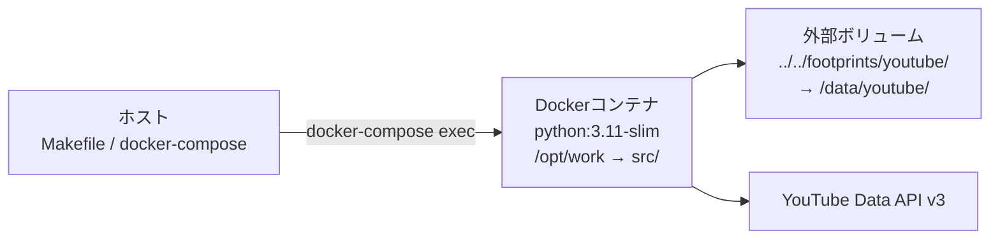
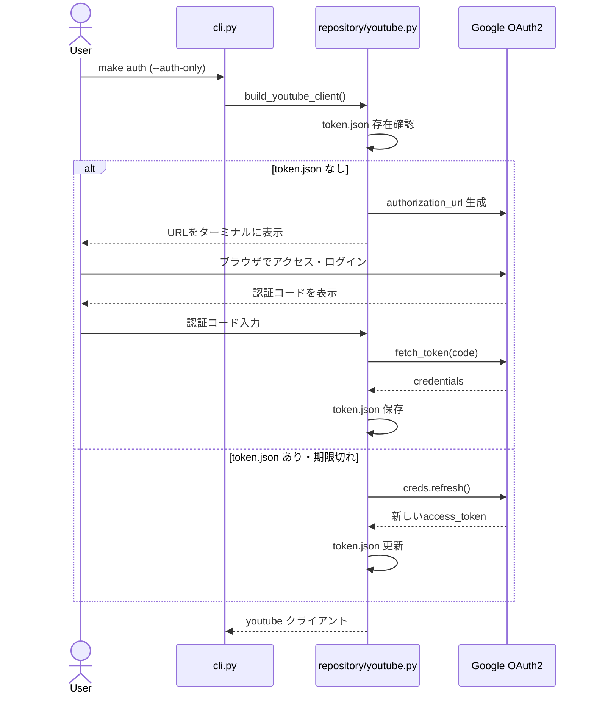

# 技術仕様書

## テクノロジースタック

| カテゴリ | 技術 | バージョン | 用途 |
|---|---|---|---|
| 言語 | Python | ^3.11 | アプリケーション全体 |
| パッケージ管理 | Poetry | 最新 | 依存関係管理・仮想環境 |
| コンテナ | Docker + docker-compose | — | 実行環境の統一 |
| YouTube API | google-api-python-client | ^2.131.0 | YouTube Data API v3 クライアント |
| OAuth2 | google-auth-oauthlib | ^1.2.0 | OAuth2フロー |
| 認証リフレッシュ | google-auth-httplib2 | ^0.2.0 | トークンリフレッシュ |
| CLI UI | questionary | ^2.0.1 | 十字キー選択UI |
| リトライ | tenacity | ^9.0.0 | 依存として含む（現在はカスタム実装） |
| テスト | pytest | ^8.0.2 | テストフレームワーク |
| カバレッジ | pytest-cov | ^4.1.0 | テストカバレッジ計測 |
| モック | pytest-mock | ^3.14.0 | モック・スタブ |

---

## 実行環境

- ホストから `docker-compose exec workspace python main.py` で実行
- `src/` ディレクトリをコンテナ内 `/opt/work` にマウント
- `playlist_history.csv` は `../../footprints/youtube/` → `/data/youtube/` にマウント（コンテナ外永続化）

---

## 認証フロー

---

## API Quota管理

YouTube Data API v3 の Quota 消費:

| 操作 | Quota消費 |
|---|---|
| `playlistItems.insert`（追加） | 50 units |
| `playlistItems.delete`（削除） | 50 units |
| `playlistItems.list`（削除前の item_id 検索） | 1 unit |
| `playlistItems.list`（プレイリスト全件取得） | 1 unit/ページ |
| `playlists.list` | 1 unit |

デフォルト日次 Quota: 10,000 units

- Quota超過（403 quotaExceeded）時は `QUOTA_WAIT`（60秒）待機してポーリング再試行
- `INTERVAL_SECONDS`（デフォルト1.0秒）をリクエスト間に挿入して消費を平準化

---

## 技術的制約と要件

- **認証方式は OAuth2 のみ**: 個人プレイリスト操作にサービスアカウントは使用不可
- **ブラウザ不要の認証フロー**: Docker環境でブラウザが開けないため `urn:ietf:wg:oauth:2.0:oob` フローを使用
- **CSV履歴はローカル正本**: API全件取得はコスト大のため、ローカル `playlist_history.csv` を正本として扱う
- **ページネーション必須**: `playlistItems.list` は最大50件/ページのため、50件超プレイリストは `nextPageToken` でループ
- **inputファイルはクリアしない**: 冪等性のため、`add.txt` / `remove.txt` はユーザーが手動管理
