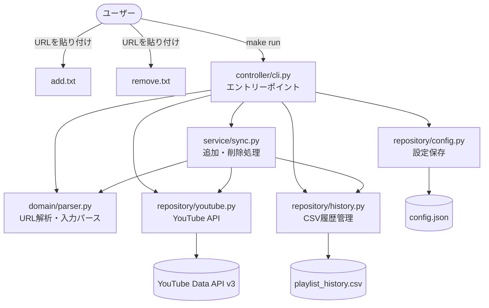
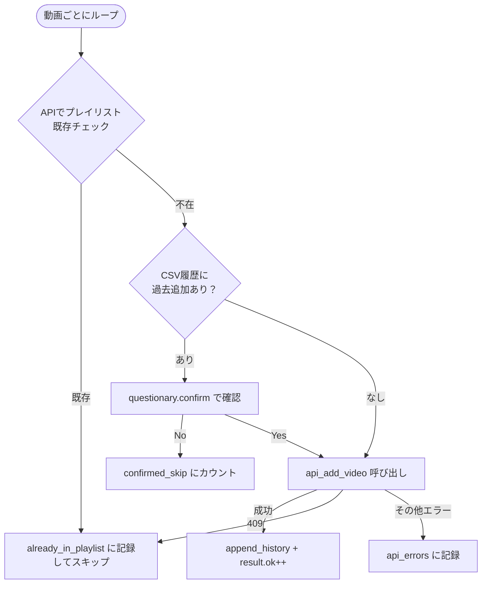

# 機能設計書

## アーキテクチャ概要



---

## コンポーネント設計

### controller/cli.py — CLIオーケストレーター

責務: 認証・プレイリスト選択・同期処理の起動・サマリー表示を順に実行する

主要関数:
- `main()` — アプリ全体のエントリーポイント
- `choose_playlists(youtube, config_path)` — インタラクティブUI でプレイリストを選択し `config.json` に保存

パス定数:
| 定数 | パス |
|---|---|
| `CSV_PATH` | `/data/youtube/playlist_history.csv` |
| `CONFIG_PATH` | `src/config.json` |
| `CREDENTIALS_PATH` | `src/client_secret.json` |
| `TOKEN_PATH` | `src/token.json` |
| `INPUT_DIR` | `src/input/` |

---

### domain/parser.py — URL解析・入力パース

責務: URL文字列から video_id を抽出し、入力ファイルをパースする

#### `extract_video_id(url: str) -> str | None`

対応URL形式:

| 形式 | 例 |
|---|---|
| `watch?v=` | `https://www.youtube.com/watch?v=dQw4w9WgXcY` |
| `youtu.be/` | `https://youtu.be/dQw4w9WgXcY` |
| `shorts/` | `https://www.youtube.com/shorts/dQw4w9WgXcY` |
| `embed/` | `https://www.youtube.com/embed/dQw4w9WgXcY` |
| `v/` | `https://www.youtube.com/v/dQw4w9WgXcY` |

`urllib.parse` でURLを解析し、video_id が `^[A-Za-z0-9_-]{11}$` に一致しない場合は `None` を返す。

#### `parse_input(path: Path) -> ParseResult`

- `URL | Title` 形式をパース（タイトルは省略可）
- 同一ファイル内の重複 video_id は先勝ちで除去し `duplicate_ids` に記録
- 抽出失敗行は `invalid_lines` に記録

---

### domain/models.py — データモデル

```python
@dataclass
class ParseResult:
    items: list[tuple[str, str, str]]   # (video_id, title, url)
    invalid_lines: list[str]
    duplicate_ids: list[str]

@dataclass
class AddResult:
    ok: int
    confirmed_skip: int
    already_in_playlist: list[tuple[str, str]]   # (video_id, title)
    api_errors: list[tuple[str, str, str]]        # (video_id, title, error)

@dataclass
class RemoveResult:
    ok: int
    not_found: list[tuple[str, str]]             # (video_id, title)
    api_errors: list[tuple[str, str, str]]        # (video_id, title, error)
```

---

### service/sync.py — 同期処理

責務: parse → チェック → API操作 → 履歴記録 のサイクルを管理

#### `process_add(youtube, playlist, history, add_file, csv_path) -> AddResult`

追加処理フロー:



#### `process_remove(youtube, playlist, remove_file, csv_path) -> RemoveResult`

- `parse_input` でパース後、`api_remove_video` を呼び出す
- 削除成功時に `append_history` で履歴記録
- 対象なし（False返却）は `not_found` に記録

#### `print_summary(...)`

処理後に追加成功数・削除成功数と警告セクション（無効URL・重複・スキップ・APIエラー）を表示する。警告がない場合は警告セクションを表示しない。

---

### repository/youtube.py — YouTube API

責務: YouTube Data API v3 との通信を担当

| 関数 | API | 説明 |
|---|---|---|
| `build_youtube_client(credentials_path, token_path)` | OAuth2 | 認証クライアントを構築。token.json がなければコンソール認証フローを実行 |
| `fetch_playlists(youtube)` | `playlists.list` | 自分のプレイリスト一覧を取得（最大50件） |
| `fetch_playlist_video_ids(youtube, playlist_id)` | `playlistItems.list` | プレイリスト内の全 video_id を取得（ページネーション対応） |
| `api_add_video(youtube, playlist_id, video_id)` | `playlistItems.insert` | 動画を追加。409 は False を返す |
| `api_remove_video(youtube, playlist_id, video_id)` | `playlistItems.list` + `.delete` | 動画を削除。不在は False を返す |
| `api_call_with_retry(fn)` | — | Quota超過（403 quotaExceeded）時に `QUOTA_WAIT` 秒待機して再試行 |

---

### repository/history.py — CSV履歴管理

責務: `playlist_history.csv` の読み書きを担当

| 関数 | 説明 |
|---|---|
| `init_csv(path)` | CSVが存在しない場合はヘッダー行を作成 |
| `load_history(path)` | CSV全行を `list[dict]` で返す |
| `append_history(...)` | 1件追記する |
| `was_previously_added(video_id, history, playlist_id)` | 同プレイリストへの過去追加履歴があるかチェック |

---

### repository/config.py — 設定管理

責務: `config.json`（前回選択プレイリスト）の読み書きを担当

---

## データモデル定義

### `playlist_history.csv`

| カラム | 型 | 例 |
|---|---|---|
| timestamp | YYYY-MM-DD HH:MM:SS | 2026-06-26 10:00:00 |
| video_id | 11文字英数字 | dQw4w9WgXcY |
| title | 文字列（空可） | AI入門動画 |
| url | URL文字列 | https://youtube.com/watch?v=... |
| action | `add` / `remove` | add |
| playlist_id | YouTubeプレイリストID | PLxxxxxxxxxx |

### `config.json`

```json
{
  "last_add_playlist_id": "PLxxxxxxxxxx",
  "last_remove_playlist_id": "PLyyyyyyyyyy"
}
```

---

## エラーハンドリング方針

| エラー | 対応 |
|---|---|
| 409 Conflict（追加済み） | WARNログ、`already_in_playlist` にカウント |
| 404 Not Found（削除対象なし） | WARNログ、`not_found` にカウント |
| 403 quotaExceeded | `QUOTA_WAIT` 秒待機してポーリング再試行 |
| その他 HttpError | ERRORログ、`api_errors` にカウント |
| video_id 抽出失敗 | WARNログ、`invalid_lines` にカウント |
| 重複 video_id | INFOログ、`duplicate_ids` にカウント |
